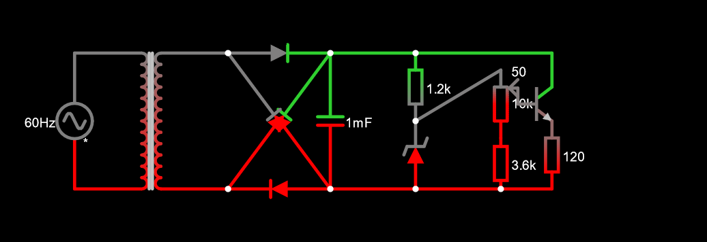

# Fonte de Tensão
Trabalho I de Eletronica BCC23 - Fonte de Tensão

# Membros
Os integrantes pertencentes a este grupo são:
  - 14675441 - **Henrique Drago** - [HenriqueDrago](https://github.com/HenriqueDrago)
  - 14614564 - **Henrique Yukio Sekido** - [Riquey654](https://github.com/Riquey654)
  - 14747211 - **João Pedro Boiago Gomes Santana** - [JopedroBoiago135](https://github.com/JopedroBoiago135)

 
  
# Objetivo
Projetar e construir uma fonte de tensão ajustavel entre 3V e 12V a partir de uma fonte energia alternada (60 hertz) de 127V com pico de 180V.

# Componentes Utilizados
| Quantidade | Componentes                        |   Valor R$   |
|------------|------------------------------------|--------------|
| 4          | Diodo                              |   R$ 02,00   |
| 1          | Capacitor 1mF                      |   R$ 00,50   |
| 1          | Resistor 3.6k                      |   R$ 00,70   |
| 1          | Resistor 1.2k                      |   R$ 00,07   |
| 1          | Potenciômetro  10k                 |   R$ 04,75   |
| 1          | Diodo Zener (13V)                  |   R$ 00,48   |
| 1          | Transistor NPN 2N3904              |   R$ 01,60   |
| 1          | Transformador (127V -> 12V 300mA)  |   R$ 43,20   |
| 1          | Resistor 120                       |   R$ 00,70   |
| Total      |                                    |   R$ 54,00   |

# Explicação das Peças

- Transformador: Responsável por converter a tensão da rede eletrica (127V rms, 180V de pico) para a desejada no circuito (12V de rms, 18V de pico). Funciona por meio de indução magnetica, a razão entre o numero de voltas do fio em cada lado do transformador dita a taxa de conversão da corrente;

- Diodos: Permitem a passagem de corrente em só um sentido. A Ponte de Diodos é construida de forma que independentemente da fase da tensão, sempre chegará um valor positivo ao outro lado da ponte, tornando a corrente continua;

- Capacitor: Armazena eletrons durante os picos e libera durante os vales, diminuindo a variação da tensão;

- Diodo Zenner: Limita a corrente maxima que chega no resistor final;

- Resistor 1.2k: Utilizado para reduzir o desperdicio de energia;

- Resistor 3.6k: Utilizado para ajustar o limite inferior para 3V;

- Potenciômetro: Permite o ajuste entre 3V e 12V;

- Transistor: Trabalha junto do potenciômetro permitir o ajuste entre 3V e 12V;

- Resistor 120: Simula a saída da fonte.

# Calculo da Capacitância

Ripple desejado: 4.8%

Formula: C = Io/(2f * Vs * Ripple)

Sendo, no nosso caso, Io = Iz + Is

Iz = (18.2 - 13)/1200 = 4.3mA

Is = 100mA

Io = 100 + 4.3 = 104.3mA

C = 0.1043 / (2 * 60 * 18.2 * 0.048)

Capacitancia = 994.9252uF

Foi escolhido o valor de mercado 1000uF.

# Esquema do Projeto no Falstad

Link: https://tinyurl.com/2etd5z8j

# Esquema do TinkerCad

# Esquemático no Eagle

# PCB no Eagle

# Video Explicativo do Projeto (Youtube)

# Agradecimentos
- Agradecemos ao [Prof Simões](https://github.com/simoesusp) (vulgo Simas), pelos ensinamentos de eletronica e de como soldar;
- Ao empenho do grupo ao decorrer de todo o trabalho e esforço;
- Rodolfo Transformador.

